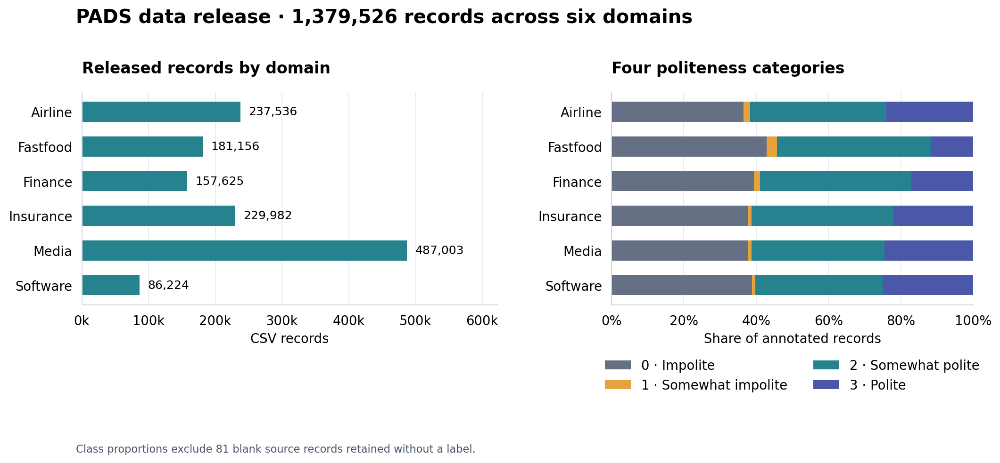
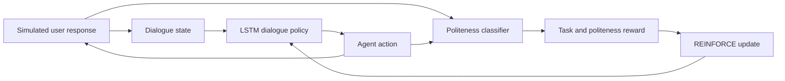
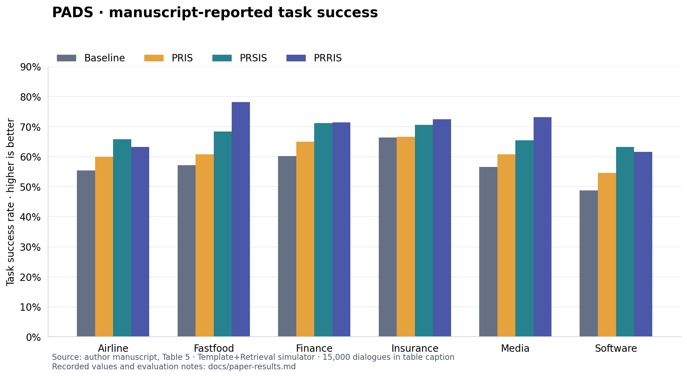

# PADS · Politeness Adaptive Dialogue System

Research code and dialogue data accompanying **[Please be polite: Towards building a politeness adaptive dialogue system for goal-oriented conversations](https://doi.org/10.1016/j.neucom.2022.04.029)**.

**Kshitij Mishra · Mauajama Firdaus · Asif Ekbal**

Indian Institute of Technology Patna

*Neurocomputing* **494** (2022), 242–254

[Paper](https://www.sciencedirect.com/science/article/pii/S0925231222003952) · [Dataset](datasets/README.md) · [Results](docs/paper-results.md) · [BibTeX](CITATION.bib)

PADS studies how a task-oriented dialogue agent can adapt its responses using
politeness feedback. The paper combines an utterance classifier, an LSTM dialogue
policy trained with reinforcement learning, and simulated conversations in six
domains: airline, fastfood, finance, insurance, media, and software.

Start with the [dataset guide](datasets/README.md), explore the
[experimental results](docs/paper-results.md), or run the dialogue simulator
below. The [implementation notes](docs/implementation-notes.md) describe the
available components and their relationship to the paper.

## Quick start

Use **Python 3.11** for the simulator and optional TensorFlow trainer.

```bash
git clone https://github.com/Mishrakshitij/PADS.git
cd PADS
python3.11 -m venv .venv
source .venv/bin/activate
python -m pip install -e .

# Run the bus-scheduling simulator with a slot-filling policy.
python -m pads simulate --policy slot --episodes 100 --seed 42 \
  --output runs/slot-baseline.csv

# Compare a random policy over valid actions.
python -m pads simulate --policy random --episodes 100 --seed 42 \
  --output runs/random-baseline.csv
```

Both commands print a JSON summary and write per-episode CSV metrics. These
baseline policies need NumPy only; they do not download or load a language model.
`python -m pads --help` lists the entry points.

## Dataset

The PADS dataset contains **1,379,526 utterance records** from customer–agent
conversations across six domains. Four-class labels are available for
**1,379,445 records**; 81 whitespace-only records are retained without a label.
The [dataset guide](datasets/README.md) describes the schema, coverage, and source files;
the [annotation guidelines](docs/annotation-guidelines.md) explain the four labels.

Use `politeness_label` for the four-class task:
**0** = impolite, **1** = somewhat impolite, **2** = somewhat polite,
**3** = polite. These categories measure expressed courtesy; ordinary direct
questions and bare slot values can receive `0`.

| Domain | Records | 0 | 1 | 2 | 3 |
| --- | ---: | ---: | ---: | ---: | ---: |
| Airline | 237,536 | 86,797 | 4,208 | 89,516 | 56,994 |
| Fastfood | 181,156 | 77,556 | 5,267 | 76,963 | 21,343 |
| Finance | 157,625 | 62,073 | 2,545 | 66,143 | 26,861 |
| Insurance | 229,982 | 86,869 | 2,176 | 90,320 | 50,610 |
| Media | 487,003 | 183,302 | 5,157 | 178,999 | 119,525 |
| Software | 86,224 | 33,431 | 844 | 30,292 | 21,654 |
| **Total** | **1,379,526** | **530,028** | **20,197** | **532,233** | **296,987** |



Counts and proportions come from [`datasets/summary.csv`](datasets/summary.csv).
Class proportions exclude the 81 unscorable records. The CSV shards are at most
48 MiB each and can be cloned with normal Git.

Load a complete domain with pandas:

```bash
python -m pip install "pandas>=1.5,<3"
```

```python
import json
from pathlib import Path
import pandas as pd

dataset_dir = Path("datasets")
manifest = json.loads((dataset_dir / "manifest.json").read_text())
domain = next(item for item in manifest["domains"] if item["domain"] == "media")
data = pd.concat(
    [pd.read_csv(dataset_dir / part["path"], dtype=str, keep_default_na=False)
     for part in domain["files"]],
    ignore_index=True,
)
annotated = data.loc[data["annotation_status"] == "annotated"].copy()
annotated["politeness_label"] = annotated["politeness_label"].astype("int8")
print(annotated["politeness_label"].value_counts().sort_index())
```

Verify the complete release using the Python standard library:

```bash
python scripts/verify_dataset.py
```

The verifier checks every CSV, file hash, label, and aggregate count. With the
optional `--source-archive RL_PADS_Data.zip` argument, it also checks that every
original field and row has been preserved. The source ZIP is ignored by Git.

## Method and manuscript results

The paper uses four politeness levels (`impolite`, `somewhat_impolite`,
`somewhat_polite`, `polite`) in its classifier and reward design.



| Reward variant | Main idea in the manuscript |
| --- | --- |
| Baseline | Task success, failure, and a turn cost |
| PRIS | Politeness feedback from sampled intent utterances |
| PRSIS | PRIS plus slot-value response feedback |
| PRRIS | PRSIS plus a penalty for repeated agent actions |

The author manuscript reports these task success rates for the
**Template+Retrieval simulator** in Table 5. Its caption specifies 15,000 training
dialogues; the [results notes](docs/paper-results.md) document the evaluation
settings and source tables.

| Domain | Baseline | PRIS | PRSIS | PRRIS |
| --- | ---: | ---: | ---: | ---: |
| Airline | 55.4% | 60.0% | **65.8%** | 63.2% |
| Fastfood | 57.2% | 60.8% | 68.4% | **78.2%** |
| Finance | 60.2% | 65.0% | 71.2% | **71.4%** |
| Insurance | 66.4% | 66.6% | 70.6% | **72.4%** |
| Media | 56.6% | 60.8% | 65.4% | **73.2%** |
| Software | 48.8% | 54.6% | **63.2%** | 61.6% |



The exact values and provenance are in [`docs/paper-results.csv`](docs/paper-results.csv).
[Additional tables](docs/paper-results.md) cover classifier evaluation, simulator
comparisons, and human evaluation.

Regenerate both README figures:

```bash
python -m pip install -e ".[plots]"
python scripts/plot_results.py
```

## Train a dialogue policy

The maintained trainer uses a 32-unit LSTM, REINFORCE, and RMSProp, following the
bus-scheduling archive. TensorFlow 2.15 is used through `tf.compat.v1` because the
original recurrent APIs predate Keras 3.

```bash
python -m pip install -e ".[train]"
python -m pads train --episodes 1000 --eval-episodes 100 --seed 42 \
  --model-dir checkpoints/bus-baseline --output runs/training.csv
```

The default reward is task-based: `+20` for success, `-10` for an explicit failed
response, and `-1` per intermediate turn. Timeouts count as unsuccessful and retain
their accumulated turn costs. Training saves a checkpoint and reports a separate
evaluation over the simulator. Restore the policy with
`--restore checkpoints/bus-baseline` when starting another training run.

The original prototype's politeness reward is available only when you supply
a compatible **four-class DistilBERT checkpoint**:

```bash
python -m pip install -e ".[train,politeness]"
python -m pads train --reward politeness \
  --classifier-dir /path/to/four-class-distilbert-checkpoint \
  --episodes 1000 --seed 42 --model-dir checkpoints/bus-politeness
```

Supply a checkpoint whose classes follow the order given above. The reward
matrix, checkpoint requirements, and correspondence with the manuscript are
documented in the [implementation notes](docs/implementation-notes.md), together
with details of action masking, episode state, and recurrent training.

## Repository layout

```text
PADS/
├── src/pads/              # Simulator, policies, CLI, optional classifier and trainer
├── datasets/             # 10 CSV shards, dataset card, checksums, class counts
├── data/simulator/       # Original bus-simulator assets
├── docs/                 # Reported tables, figures, and implementation notes
├── scripts/              # Dataset verification and figure generation
├── tests/                # Regression tests for simulator and policy behavior
├── legacy/               # Historical experiment logs and incomplete HCN fragment
├── archives/RL_PADS.zip  # Unmodified original code release
├── licenses/             # Upstream MultiDoGO license and attribution
├── CITATION.bib          # PADS and MultiDoGO references
└── CITATION.cff          # GitHub citation metadata
```

Run regression tests with `python -m unittest discover -s tests -v` after
installation. GitHub Actions runs the baseline checks and full dataset
verification on pushes and pull requests, plus a separate TensorFlow test job.
The [release validation record](docs/validation.md) documents local checks and
their limits.

## Citation and attribution

If you use this repository, please cite the PADS paper:

```bibtex
@article{mishra2022please,
  title = {Please be polite: Towards building a politeness adaptive dialogue system for goal-oriented conversations},
  author = {Mishra, Kshitij and Firdaus, Mauajama and Ekbal, Asif},
  journal = {Neurocomputing},
  volume = {494},
  pages = {242--254},
  year = {2022},
  doi = {10.1016/j.neucom.2022.04.029},
  url = {https://doi.org/10.1016/j.neucom.2022.04.029}
}
```

If you use the dialogue corpus, also cite the
[MultiDoGO paper](https://aclanthology.org/D19-1460/); its BibTeX is included in
[`CITATION.bib`](CITATION.bib). The underlying MultiDoGO data carries
CDLA-Permissive-1.0 terms and the original Amazon attribution. See
[`licenses/`](licenses/README.md) for the license texts and scope. The supplied
PADS archive did not include a software license.
